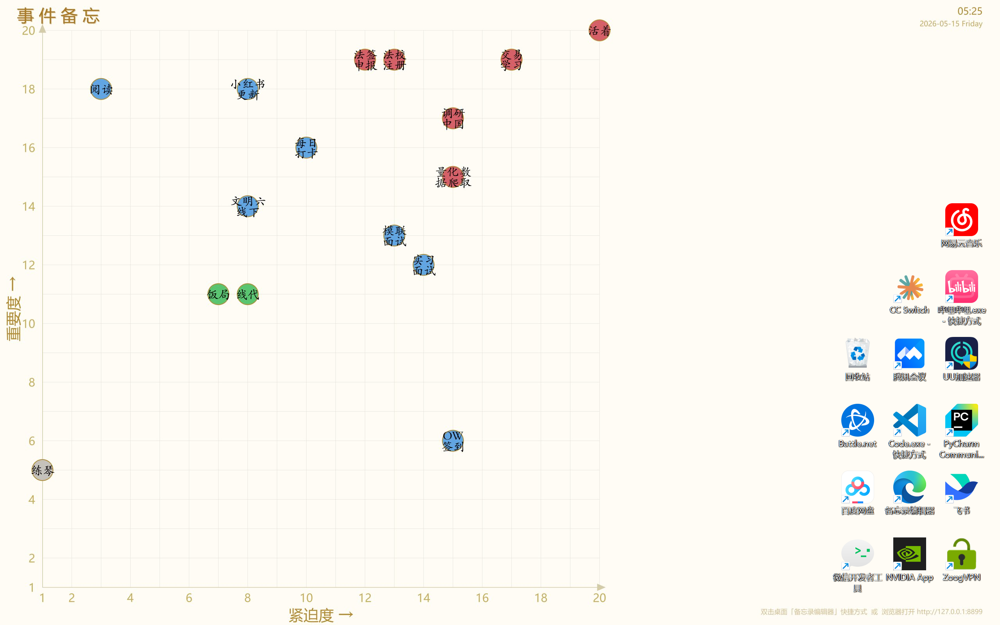

# Note Wallpaper（备忘录壁纸）

A Windows desktop memo tool that turns your wallpaper into an Eisenhower Matrix — urgency vs. importance grid. Manage tasks visually right on your desktop.

Windows 桌面备忘录工具，将壁纸变为「紧迫度 × 重要度」四象限矩阵，在桌面上直观管理事件。

## Features / 功能

- **Wallpaper as Eisenhower Matrix** — Events rendered as colored dots on a 20×20 grid, set as your Windows desktop wallpaper
- **HTML Editor Panel** — Add, edit, delete events via a browser-based side panel
- **Color-coded Priority** — Red (urgent+important), Blue, Green, White based on total score
- **Auto-refresh** — Wallpaper updates automatically when events change; clock refreshes every minute
- **Startup-friendly** — One-click install to Windows startup folder
- **Offline Mode** — Works entirely offline; localStorage fallback when engine is not running

---

## Screenshot / 截图



---

## Architecture / 架构

```
memo-wallpaper.html    ← 前端编辑器（浏览器打开，操作事件）
wallpaper_engine.py    ← 后端引擎（Python HTTP 服务 + 壁纸渲染）
launch_wallpaper.py    ← 一键启动器（无边框浏览器窗口）
```

- The HTML editor communicates with the Python engine via REST API on `127.0.0.1:8899`
- The engine renders events onto a BMP image and sets it as the Windows wallpaper
- Events persist in `%APPDATA%/memo-wallpaper/events.json`

---

## Quick Start / 快速开始

### 1. Install dependencies / 安装依赖

```bash
pip install -r requirements.txt
```

### 2. Launch / 启动

**方式 A — 完整壁纸模式（推荐）：**
```bash
python wallpaper_engine.py
```
This starts the HTTP server, renders the wallpaper, and opens the editor in your browser.

**方式 B — 轻量桌面窗口模式：**
```bash
python launch_wallpaper.py
```
Opens the editor as a borderless desktop window (no wallpaper rendering).

**方式 C — 直接打开编辑器：**
双击 `memo-wallpaper.html` 在浏览器中打开。

### 3. Set up auto-start / 开机自启

```bash
install_startup.bat    # 安装开机自启
uninstall_startup.bat  # 卸载开机自启
```

---

## Usage / 使用方法

| Action | How |
|--------|-----|
| Add event | Open editor panel → "+ 添加新事件" → fill form → save |
| Edit event | Click a dot → "编辑" button in the panel |
| Delete event | Click a dot → "删除" button |
| View details | Hover over any dot to see tooltip |
| Export/Import | Use JSON export/import buttons in the editor |
| Refresh wallpaper | Click "🖼 刷新壁纸" button (when engine is connected) |

---

## Requirements / 环境要求

- Windows 10 / 11
- Python 3.11+
- Chrome / Edge / Brave (for borderless window mode)

---

## License

MIT — see [LICENSE](LICENSE)

---

## Notes / 注意事项

- Your memo data is stored locally in `%APPDATA%/memo-wallpaper/` and your browser's localStorage. It never leaves your machine.
- The wallpaper engine must be running for the editor to sync with the wallpaper (green indicator = connected).
- 你的备忘录数据仅存储在本机，不会上传到任何服务器。
